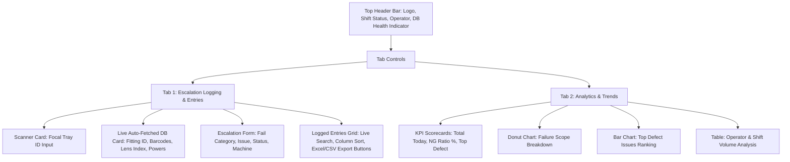
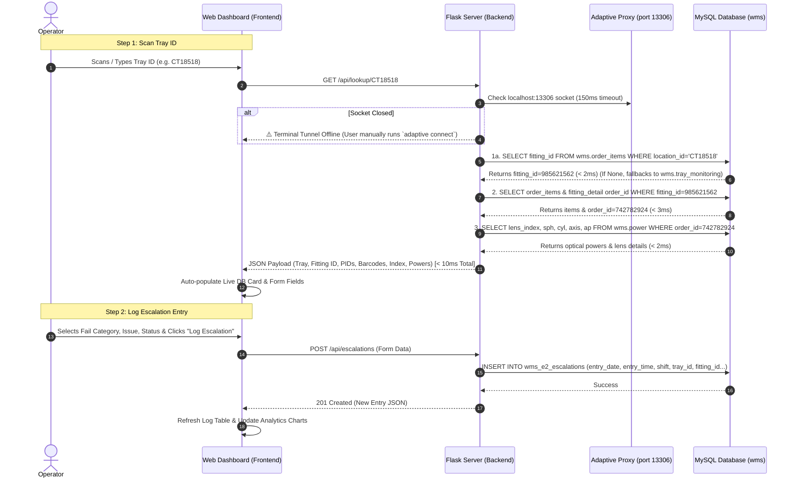

# MEI E2 Analytics & Escalation Logging Architecture

This document provides a comprehensive technical architectural specification for the **MEI E2 Escalation Logging & Analytics System**.

---

## 🏗️ System Architecture Overview

```
+---------------------------------------------------------------------------------------------------+
|                                 SHOP-FLOOR OPERATOR INTERFACE                                      |
|                                                                                                   |
|  [ Handheld USB Barcode Scanner ] ---->  [ Modern Web Dashboard (Browser) ]                       |
|                                           |-- Tab 1: Escalation Entries                           |
|                                           |-- Tab 2: Analytics & Trends                           |
+-------------------------------------------|-------------------------------------------------------+
                                            | (HTTP / REST API)
                                            v
+---------------------------------------------------------------------------------------------------+
|                                     FLASK BACKEND SERVER                                          |
|                                                                                                   |
|  [ Flask Web App (Python) ]                                                                       |
|            |                                                                                      |
|            | (Internal TCP Socket / localhost:13306)                                              |
|            v                                                                                      |
|  [ Adaptive Access Proxy Session ] (adaptive connect mysql_ro_nexs-slave02.prod.internal2 -p 13306)  |
+------------|--------------------------------------------------------------------------------------+
             | (Encrypted TLS Tunnel)
             v
+---------------------------------------------------------------------------------------------------+
|                                       MYSQL DATABASE (wms / app)                                  |
|                                                                                                   |
|  LOOKUP TABLES (Live Fetch < 10ms):                                                               |
|  1. wms.order_items      --> Primary Active Location Check (location_id -> fitting_id)            |
|  2. wms.tray_monitoring  --> Historical Fallback Ledger (tray_id -> wms_fitting_id)               |
|  3. wms.order_items      --> Item Lookup (fitting_id -> product_id, barcode, fitting_type)        |
|  4. wms.fitting_detail   --> Order Link (fitting_id -> order_id)                                  |
|  5. wms.power            --> Optical Powers & Lens Index (order_id -> lens_index, SPH, CYL, etc.) |
|                                                                                                   |
|  LOGGING TABLE (Escalation Records):                                                              |
|  5. wms_e2_escalations   --> Stores all logged escalations & analytics data in MySQL            |
+---------------------------------------------------------------------------------------------------+
```

---

## 🎨 Frontend UI Architecture (2-Tab Layout)

The web client is structured as a responsive single-page web application (SPA) with **2 primary tabs**:



### Component Details
1. **Top Navigation & Status Bar**:
   - Displays real-time database status (`🟢 MySQL Connected (8ms)`).
   - Auto-detects current shift (**Shift A**, **Shift B**, **Shift C**).
2. **Tab 1 — Escalation Logging & Entries**:
   - **Barcode Trigger**: Auto-submits query on scanner `Enter` keypress or input paste.
   - **Auto-Fill Card**: Displays `Fitting ID`, `Order ID`, `Frame PID`, `Right Lens Barcode`, `Left Lens Barcode`, `Lens Index` (`1.56`, `1.60`, etc.), `Lens Name`, and `Optical Powers` (`SPH`, `CYL`, `AXIS`, `ADDN`).
   - **Form Submission**: Submits escalation log directly to MySQL database and updates the table instantly.
   - **Export Controls**: 1-Click **`Export as .XLSX`** (matches `E2 Escalation` Excel template) and **`Export as .CSV`**.
3. **Tab 2 — Analytics & Trends**:
   - **Interactive Charts**: Rendered using Chart.js with dark-mode styling.
   - **Date & Shift Filters**: Filter quality metrics across custom date ranges and production shifts.

---

## ⚡ Data Flow & Sequence Diagram



---

## 🗄️ MySQL Database Schemas

### 1. Live Lookup Tables (`wms`)
* **`wms.tray_monitoring`**: `tray_id` (VARCHAR), `wms_fitting_id` (BIGINT)
* **`wms.order_items`**: `fitting_id` (BIGINT), `product_id` (INT), `barcode` (VARCHAR), `fitting_type` (ENUM: `FRAME`, `RIGHTLENS`, `LEFTLENS`, `REQD`, `NOT_REQD`)
* **`wms.fitting_detail`**: `fitting_id` (BIGINT), `order_id` (INT)
* **`wms.power`**: `order_id` (INT, Indexed PK), `product_id` (INT), `lens_index` (DOUBLE), `sph` (VARCHAR), `cyl` (VARCHAR), `axis` (VARCHAR), `ap` (VARCHAR), `lensname` (VARCHAR)

### 2. Escalation Logging MySQL Schema
Table: **`wms_e2_escalations`** (Stores all logged escalation records in MySQL)

| Column Name | MySQL Data Type | Description |
| :--- | :--- | :--- |
| `id` | BIGINT AUTO_INCREMENT PRIMARY KEY | Unique record ID |
| `entry_date` | DATE | Entry Date (`YYYY-MM-DD`) |
| `entry_time` | TIME | Entry Time (`HH:MM:SS`) |
| `shift` | VARCHAR(10) | Production Shift (`Shift A`, `Shift B`, `Shift C`) |
| `shift_ic` | VARCHAR(50) | Shift In-Charge Supervisor |
| `operator` | VARCHAR(50) | E2 Machine Operator |
| `tray_id` | VARCHAR(30) | Unique Tray ID scanned |
| `fitting_id` | VARCHAR(30) | Auto-fetched Fitting ID |
| `order_id` | VARCHAR(30) | Auto-fetched Order ID |
| `jit_status` | VARCHAR(20) | Classification (`JIT`, `NON JIT`) |
| `cut_status` | VARCHAR(20) | Lens Status (`CUT`, `UNCUT`) |
| `frame_pid` | VARCHAR(30) | Required Frame PID |
| `right_lens_barcode` | VARCHAR(50) | Required Right Lens Barcode |
| `left_lens_barcode` | VARCHAR(50) | Required Left Lens Barcode |
| `lens_index` | VARCHAR(10) | Optical Lens Index (`1.56`, `1.60`, etc.) |
| `sph` | VARCHAR(10) | Prescription Sphere Power |
| `cyl` | VARCHAR(10) | Prescription Cylinder Power |
| `axis` | VARCHAR(10) | Prescription Axis Angle |
| `addn` | VARCHAR(10) | Prescription Addition Power |
| `fail_category` | VARCHAR(30) | Scope (`LEFT LENS`, `RIGHT LENS`, `BOTH LENS`, `ALL ITEMS`) |
| `issue` | VARCHAR(100) | Defect Cause (`WRONG PICKING`, `WRONG POWER SPH`, etc.) |
| `status` | VARCHAR(30) | Result (`NG`, `OK`, `RETURN TO JIT ASRS`) |
| `machine` | VARCHAR(30) | Machine Tag / Identifier |
| `created_at` | DATETIME | Timestamp of entry creation |

---

## 🛡️ 24/7 Availability & Resilience Architecture

1. **Automatic Port 13306 Health Monitoring & Threading Limits**:
   - Python checks port `13306` socket before executing live DB queries.
   - If port `13306` is disconnected, Python automatically launches `adaptive connect mysql_ro_nexs-slave02.prod.internal2 -p 13306` in a background daemon thread.
   - Global `threading.Lock()` ensures the PyMySQL connection is thread-safe across concurrent scans.
2. **Non-Blocking Query Capping (DoS Prevention)**:
   - Queries strictly use `connect_timeout=3`, `read_timeout=4`, and `write_timeout=3` to guarantee that silent proxy network drops never deadlock the UI thread.
3. **1-Click Excel Export Compatibility**:
   - The export module utilizes `openpyxl` to build `.xlsx` workbooks formatted identically to `E2 escalation (1).xlsx`.
